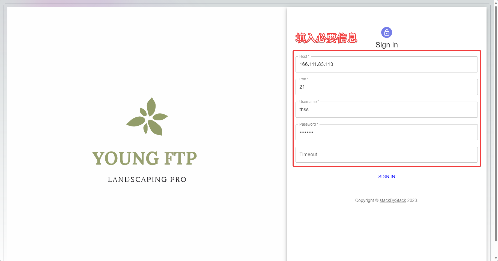

# ftp-server-client
ftp-server-client

## server 
1. Log management utils/logger.c, utils/logger.h; Provide convenience for FTP server managers to audit the operation status

2. Thread pools utils/threadPool.c, utils/threadPool.h pre create several worker threads, using task queues to avoid the overhead of thread creation and destruction; The functions of multi-user login, multi file simultaneous interpreting and asynchronous listening port are realized by using thread pool; The task function parameters are uniformly defined in utils/argTypes.h

3. File system interaction utils/fileSystem.c, utils/fileSystem.h encapsulate system call functions

4. Socket functions utils/socketConn.c, utils/socketConn.h encapsulate socket system call functions

5. Command processing cmd.c, cmd.h is responsible for handling various commands, corresponding parameters, and exception handling

6. Server server.c, server.h are responsible for handling single FTP session creation and subsequent processing

## client
1. Frontend nextjs+React+MaterialUI+tailwindCSS+JavaScript as GUI

2. I implemented a Python socket based SDK using backend Flask+FTP and FTP

